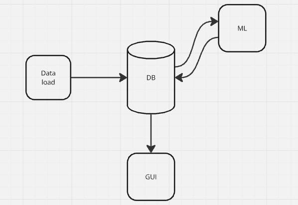

# AutoML-система для задач компьютерного зрения

## Описание

Данный проект представляет реализацию **простой AutoML-системы** для автоматизации решения задач компьютерного зрения (CV). Система минимизирует ручные операции, такие как подготовка данных и выбор модели.



### Поддерживаемые типы задач:
1. **Классификация**  
   Определение категории, к которой принадлежит изображение.  
2. **Сегментация**  
   Пиксельная классификация изображения с разметкой объектов.

## Автоматизация процессов

Система автоматически анализирует предоставленный набор данных и определяет, какие действия необходимо выполнить:  
- **Обучение модели** — если данные загружены впервые.  
- **Дообучение модели** — если в данных обнаружены изменения или добавлены новые данные.  
- **Тестирование модели** — если в папке `test` присутствуют данные для инференса.  

### Управление моделями
Каждая обученная модель автоматически сохраняется в базе данных (БД), что позволяет:  
- Использовать уже обученные модели для быстрого тестирования.  
- Продолжать обучение без необходимости начинать с нуля.  

---

### Пример сценария использования
1. Загружаете новый набор данных — система автоматически обучает модель.  
2. Добавляете новые изображения в `dataset` — система выполняет дообучение.  
3. Загружаете изображения в папку `test` — система запускает инференс и сохраняет результаты.  

---

## Загрузка данных

Система поддерживает два способа загрузки данных: **Google Drive** и **ZIP-архив**.  

### **1. Загрузка через Google Drive**  
Для использования [Google Drive](https://drive.google.com/drive/folders/1tltCIfYpj28-xbc3Vzc4-CgXRxF2KAsU?usp=sharing) необходимо:  
1. Создать директорию с вашим именем.  
2. Внутри этой директории создать папку с названием вашей задачи (например, `classification` или `segmentation`).  
3. Разместить в ней папку `dataset`, содержащую файлы для задачи.  

#### Структура данных для задач:
- **Классификация**  
  ```plaintext
  dataset/
  ├── class1/         # Директория для изображений первого класса
  │   ├── image1.jpg
  │   ├── image2.jpg
  │   └── ...
  ├── class2/         # Директория для изображений второго класса
  │   ├── image1.jpg
  │   ├── image2.jpg
  │   └── ...
  └── ...
  ```
- **Сегментация**
    ```plaintext
    dataset/
    ├── images/         # Директория с изображениями
    │   ├── image1.jpg
    │   ├── image2.jpg
    │   └── ...
    ├── labels/         # Директория с разметкой
    │   ├── image1.txt  # Разметка для image1.jpg
    │   ├── image2.txt  # Разметка для image2.jpg
    │   └── ...
    ```
    Файл разметки для сегментации должен иметь структуру:
    ```plaintext
    класс: точки сегментов
    ```
### **2. Загрузка через ZIP-архив**
Архив загружается напрямую в директорию проекта и автоматически распаковывается.
#### Требования к структуре:
ZIP-архив должен содержать папку dataset с файлами, организованными так же, как описано выше для задач классификации и сегментации.

## Тестирование (Инференс)

Для проведения инференса по вашей задаче необходимо:  
1. Создать в директории вашей задачи папку `test`.  
2. Разместить в папке `test` изображения, для которых требуется выполнить предсказание.  

После завершения инференса результаты сохранятся в папке `result` в директории вашей задачи.

### Пример структуры:
```plaintext
classification/            # Ваша задача
├── dataset/               # Данные для обучения
├── test/                  # Изображения для инференса
│   ├── image1.jpg
│   ├── image2.jpg
│   └── ...
└── result/                # Результаты инференса (создается автоматически)
    ├── image1_result
    ├── image2_result
    └── ...
```

## Локальный запуск проекта

Для локального запуска проекта выполните следующие шаги:

1. Клонируйте репозиторий:
   ```bash
   git clone https://github.com/OdincovMD/SimpleAutoML
   ```
2. Перейдите в директорию проекта:
    ```bash
    cd SimpleAutoML
    ```
3. Создайте виртуальное окружение:
    ```bash 
    python3 -m venv venv
    ```
4. Активируйте виртуальное окружение:
    - Для Linux/macOS:
    ```bash 
    source venv/bin/activate
    ```
    - Для Windows:
    ```bash 
    venv\Scripts\activate
    ```
5. Установите зависимости:
    ```bash 
    pip install -r requirements.txt
    ```
## Лицензия

Этот проект распространяется под лицензией [MIT](LICENSE).

## Благодарности

Благодарим [@Horokami](https://github.com/Horokami), который внес свой вклад в развитие этого проекта. Также выражаем признательность за использование открытых библиотек и фреймворков, которые значительно ускоряют разработку. В частности, благодарим авторов библиотек:

[PyTorch](https://pytorch.org)  
[Google API](https://cloud.google.com/apis/)  
[ultralytics](https://github.com/ultralytics)

Если вы хотите внести свой вклад или предложить улучшения, не стесняйтесь создавать issue или pull request!
